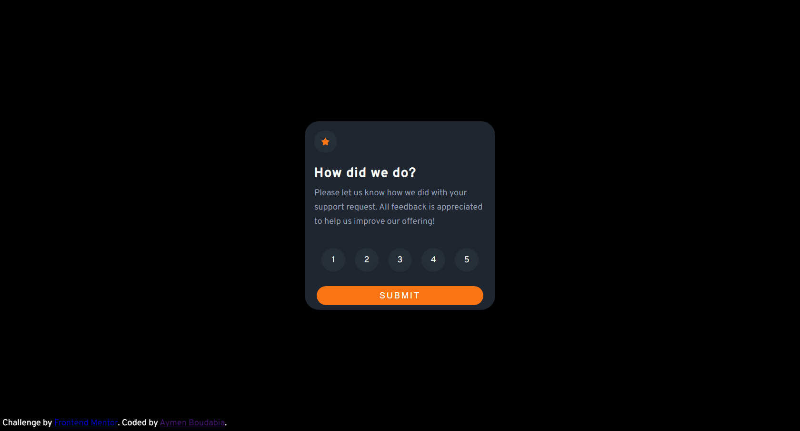
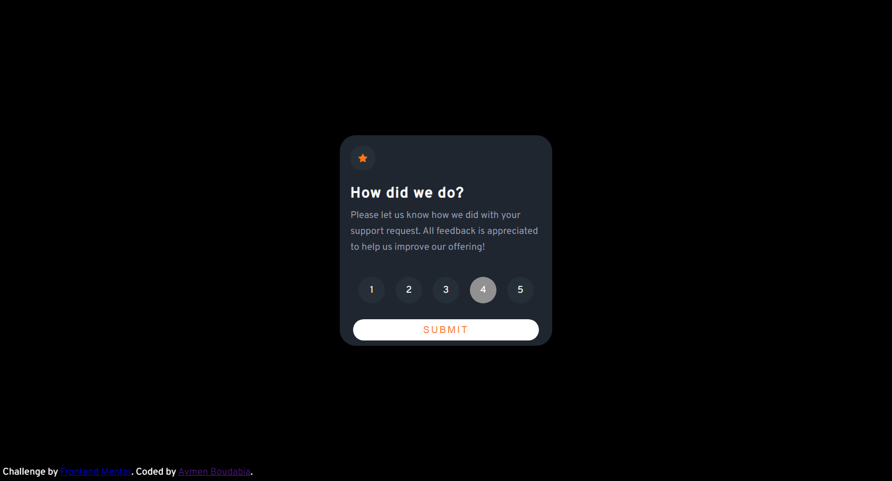
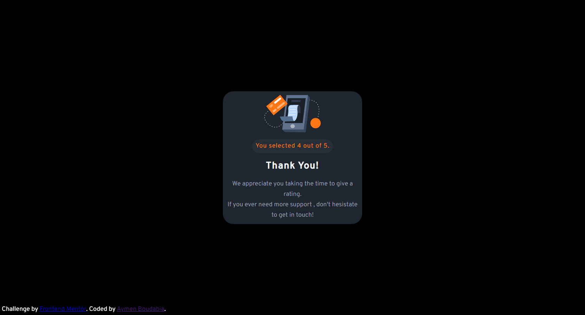

# Frontend Mentor - Interactive rating component solution

This is a solution to the [Interactive rating component challenge on Frontend Mentor](https://www.frontendmentor.io/challenges/interactive-rating-component-koxpeBUmI). Frontend Mentor challenges help you improve your coding skills by building realistic projects. 

## Table of contents

- [Overview](#overview)
  - [The challenge](#the-challenge)
  - [Screenshot](#screenshot)
  - [Links](#links)
- [My process](#my-process)
  - [Built with](#built-with)
  - [What I learned](#what-i-learned)

- [Author](#author)

## Overview

### The challenge

Users should be able to:

- View the optimal layout for the app depending on their device's screen size
- See hover states for all interactive elements on the page
- Select and submit a number rating
- See the "Thank you" card state after submitting a rating

### Screenshot
#### Desktop View:



#### Mobile View


### Links

- Live Site URL: [Interactive Rating Component](https://aymenfisher.github.io/interactive-rating-component/)

## My process

### Built with

- Semantic HTML5 markup.
- CSS custom properties.
- Flexbox.
- JavaScript Document Object Model.
-Media queries.


### What I learned

- I feel comfortable now with CSS flexbox.
- I learned how to transform HTML Radio Buttons to Rounded Buttons using CSS, the selected button will be highlighted with a custom Background color:
```css
input[type="radio"]{
    display: none;
}

input[type="radio"]:checked + label {
    background-color: #919191;
}
```
- I learned how to change some content of the HTML page after Submitting a form, i have used an event listener on the HTML Form, after the form is submitted , The HTML page will be modified, i used ```css display:none``` to hide the element from the page.
- A problem i encountered is when submitting the form, the page will refresh.To prevent that i used ```js event.preventDefault()``` on my event handler.
```js
function getValue(e) {
    e.preventDefault();
    const selected = document.querySelector('input[type="radio"]:checked').value;

    let rate=document.getElementsByClassName('rate')[0];
    let thanks=document.getElementsByClassName('thanks')[0];
    let text=document.getElementById('selected');

    text.innerHTML=`You selected ${selected} out of 5.`

    rate.style.display = 'none';
    rate.style.display = 'hidden';
    thanks.style.display = 'flex';

};

let form = document.querySelector('form');
form.addEventListener('submit', getValue); 
```

## Author

- Github - [My Github](https://github.com/Aymenfisher)
- Frontend Mentor - [@Aymenfisher](https://www.frontendmentor.io/profile/Aymenfisher)


